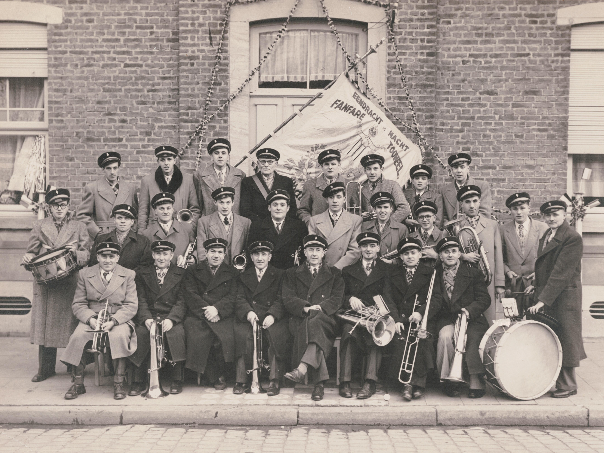
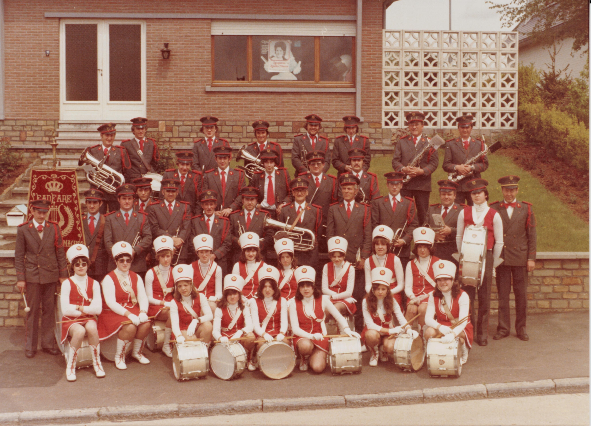
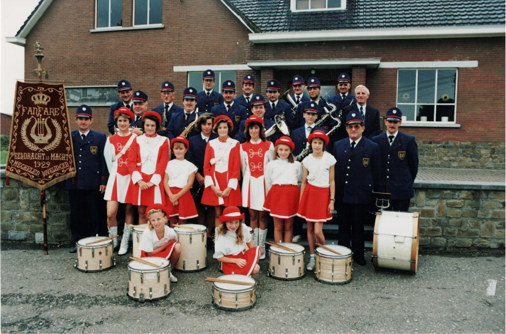
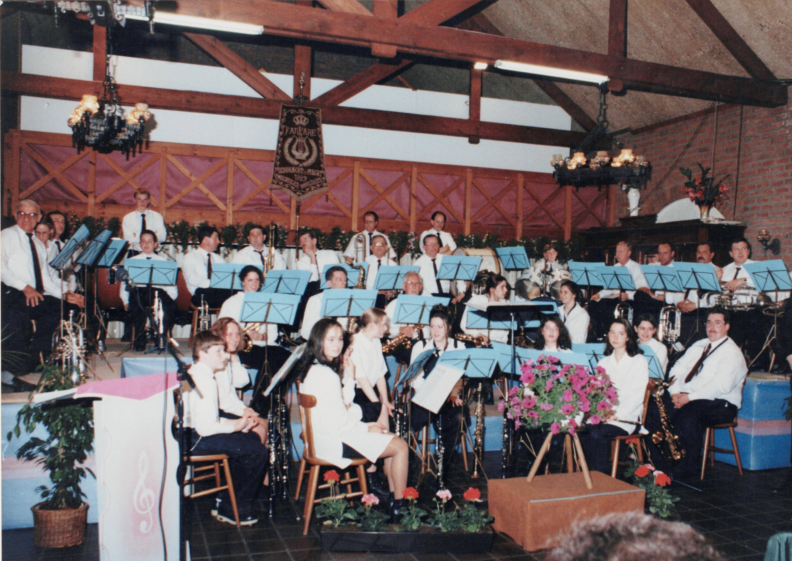
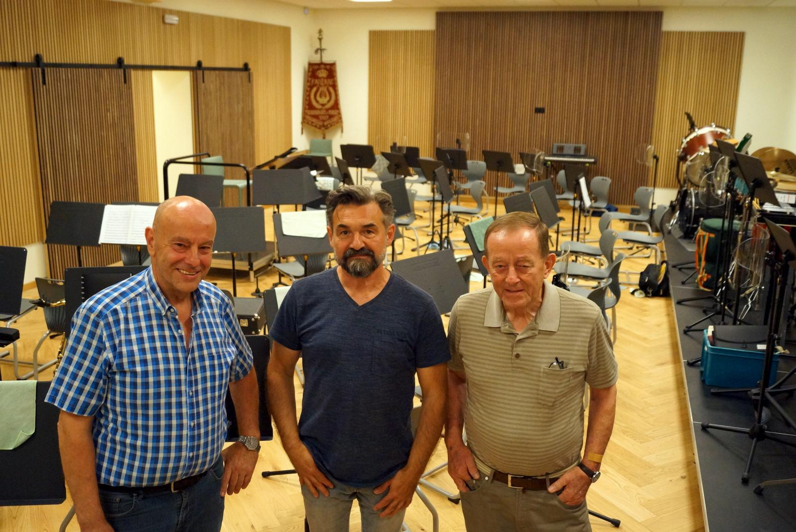
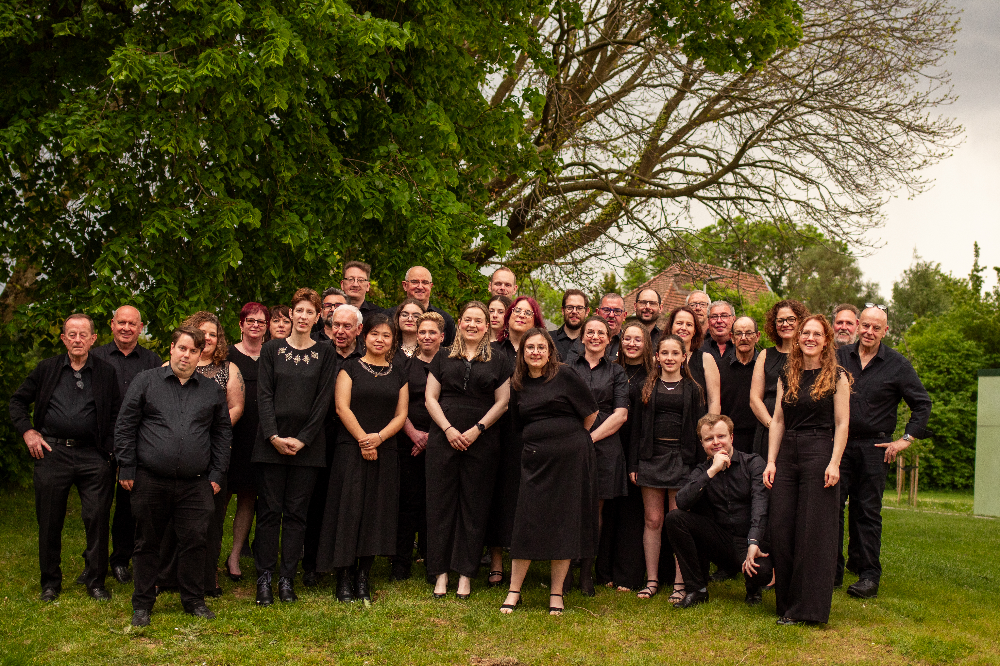

**In den beginne: Jean Van Mechelen**

De fanfare ontstond eigenlijk eerder bij toeval, bij de viering van de gouden bruiloft van Eduard Schoefs en Betje Mignolet in 1929.
De feestelingen zouden per stoet rond het dorp gereden worden. Enkele jaren voordien was in Mechelen-Bovelingen nog een fanfare geweest, maar toen hun dirigent Jean Erens naar Brussel verhuisde, werd de vereniging op non-actief gezet. Maar er waren dus nog altijd dorpelingen die in deze fanfare gespeeld hadden en een instrument bezaten.
Eén onder hen, onderwijzer Jean Van Mechelen, kreeg het idee de goudenbruiloftstoet van Eduard en Betje muzikaal op te luisteren. Andere leden werden opgetrommeld, Van Mechelen leerde hun gauw enkele marsen aan en zo namen zij deel aan de stoet en werd de huidige fanfare geboren. De daaropvolgende winter werd een cursus notenleer georganiseerd en de gemeente stelde de vereniging een lokaal ter beschikking.

In 1929 begonnen ze en in 1933 telde de groep al 33 spelende leden; enkel mannen.

Tijdens de Tweede Wereldoorlog werden alle instrumenten aangeslagen door de bezetter maar nauwelijks waren de Duitsers gevlucht of de fanfare hield al een zegeoptocht naar Rukkelingen. Het eerste uniform kwam er in 1952 onder de vorm van een groen fluwelen kepie met grijze rand en zwarte klip.

**Victor Thirion**

Toen meester Van Mechelen zich in 1957 terugtrok, nam een ander onderwijzer het roer over: namelijk Victor Thirion.
Hij zorgde ervoor dat de fanfare in 1966 uitgerust werd met een mooi grijs uniform met rode versieringen. Onder zijn impuls kwam er ook voor de eerste keer een trommelkorps, bestaande uit een groep jongens, opgeleid door Jean Nelis - die jammer genoeg niet lang daarna overleed.
In 1974 richtte Thirion een nieuw trommelkorps op, ditmaal bestaande uit allemaal meisjes. Na een opleiding van twee jaar trok dit korps de straat op, getooid in een prachtig uniform, onder leiding van de twee tamboer-majoors Marie-Sylviane Coune en Marie-Paule Vranken.
Ter gelegenheid van haar 50-jarig bestaan werd de fanfare in 1979 verheven tot 'Koninklijke' en werd een nieuw vaandel aangekocht. In 1981 kreeg het trommelkorps nieuwe uniformen.
Dan kwam 18 oktober 1984, een zwarte dag voor de fanfare: het overlijden van voorzitter en dirigent Victor Thirion.

**Hubert Neven**

De fakkel werd overgenomen door Hubert Neven die de fanfare in 1985 meteen voorzag van nieuwe uniformen: ditmaal in donkerblauw met rode bies. In 1992 legde hij het dirigeerstokje neer vanwege zijn hoge ouderdom (76 jaar). Dit belandde ad interim in de handen van voorzitter Jos Missotten en een drietal maanden bij diens broer Fernand Missotten. Fernand was ook de bezieler van de interne opleiding van de saxofonisten (rond 1990): hiervoor werden voor het eerst meisjes toegelaten bij de fanfare. Aanvankelijk waren het enkel dochters van muzikanten, maar zij brachten vriendinnen mee en zo groeide de groep weer aan.

**Jong talent**

In 1994 gaf de voorzitter het dirigentstokje over aan de toen 18-jarige Bert Mignolet. In enkele maanden tijd slaagde hij erin de fanfare op muzikaal vlak een ware metamorfose te laten ondergaan. Als hulpdirigent werd Saskia Schoefs aangesteld. Het is onder hun leiding dat in 1996 het eerste galaconcert plaatsvond, overigens één van de eersten in de streek. In 1999 telde de vereniging zo'n 36 leden.

Door de groei van de groep werd afgestapt van de blauwe uniformen: een zwarte kostuumjas met het eigen gele logo op de borstzak, wit hemd en een gele das kwamen in de plaats. De meisjes droegen een geel sjaaltje.

Na enkele jaren besloot Bert Mignolet om andere horizonten te verkennen en kwam het dirigentstokje in handen van Kurt Neven, kleinzoon van wijlen Hubert Neven.

Vanaf 2006 zou dit terechtkomen bij Bart Falise. Toen Falise in 2012 stopte, werd er niet meteen een vervanger gevonden.

Na een zoektocht van enkele weken/maanden vol proefrepetities werd in 2013 besloten om Stefaan Daems aan te stellen als nieuwe dirigent.
Ondertussen werd er alles aan gedaan om nieuwe leden te werven en zelf op te leiden: onder impuls van Saskia kwamen er weer interne muziekinitiatie, notenleerlessen en instrumentlessen. Gelukkig kregen veel nieuwelingen de smaak te pakken en trokken ze op eigen initiatief naar de muziekschool om te kunnen groeien.
Het uniform werd versimpeld naar een volledig zwarte outfit voor zowel dames als heren. Voor de galaconcerten mag het wat meer zijn: wat glitter en glamour voor wie dat wil. Eind 2021 kwam er een zwarte polo bij voor meer informele gelegenheden (dankzij onze sponsor NK Orthopedics).
Sinds 2016 trok de groep ook bijna jaarlijks op repetitieweekend naar De Zeekameel in Lombardsijde. Beproefd recept: een eenvoudig logies met simpel maar lekker eten (‘Der is noh, hé!’), hard werken op de repetities en tussenin gezelligheid met een quiz of een spelavond.
In 2019 richtte Saskia het gelegenheidszangkoor Ambitus op: zij zingen op de eigen gala- en kerstconcerten van de harmonie, geïnspireerd door het jaarthema.

**Vernieuwing en vooruitgang op elk vlak**

De coronaperiode zorgde voor vervelende hindernissen, maar de repetities gingen gewoon door in de zaal in Rukkelingen.
In 2023, na een periode van 10 jaar, werd gekozen voor vernieuwing met een kans voor eigen talent Jonas Liesenborghs.
Begin 2024 kwam deze samenwerking echter onvoorzien ten einde en belandde het stokje (tot op heden) terug in handen van oud-dirigent Kurt Neven.
Enkele handige leden bouwden tussen juni 2023 en september 2024 met de steun van de gemeente eigenhandig een verbluffend nieuw harmonielokaal, op een goed jaar tijd. De impact hiervan is erg groot: repetities in een comfortabele opstelling, een gezellige pauzeruimte, alle modern comfort en een archieflokaal waar vele verenigingen alleen van kunnen dromen.

Rode draad in ons verhaal: we blijven onszelf al bijna honderd jaar heruitvinden om te groeien, obstakels te overwinnen en nieuwe doelen te halen. Het eeuwfeest lonkt!

